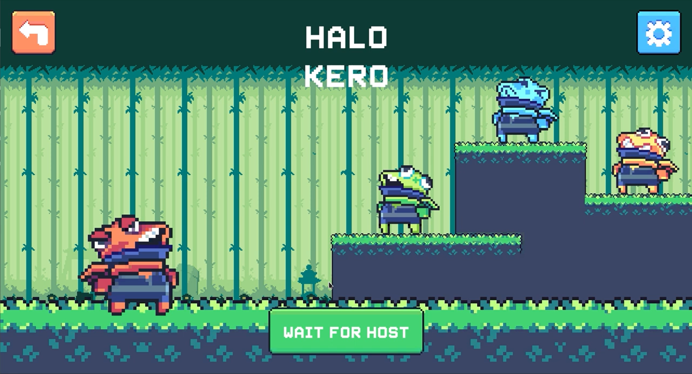
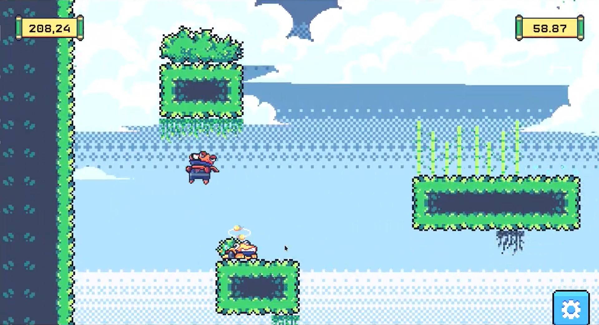
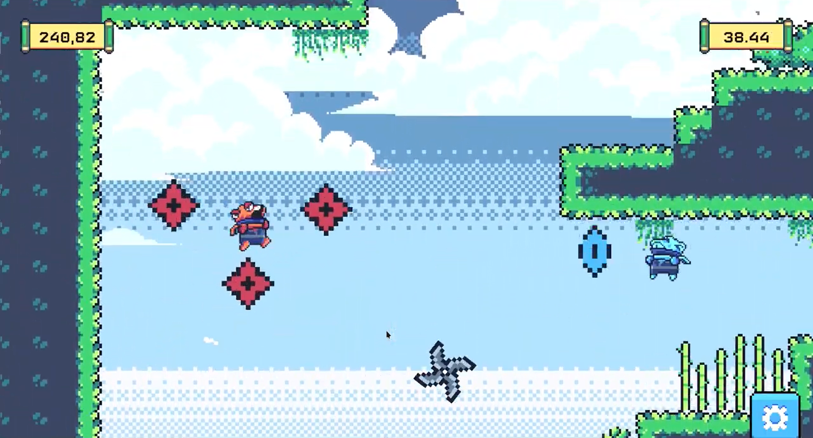

# Global Gam Jam 2024 - Halo Kero

## Lobby

## Gameplay
      

"The frog sitting at the bottom of the well" (a Vietnamese proverb) can be seen as one of the ironic phrases used by humans that often makes frogs inflate with pride. To show that not all frogs are ignorant and that their mouths are faster than their brains, in the distant land of Japan, ninja frogs prepare themselves for the day of Halo (the day when the Sun shines brightest), leaving their wells, engaging in battles with other ninja frogs, climbing up high mountains with the hope of attaining enlightenment, and regaining the respect of humans for themselves.

# Game Features:
- Maximum of 4 players play together remotely.
- Press "Space" to jump.
- Press "E" to activate your character's skill.
- Race to the top to prove you are the best ninja frog.
